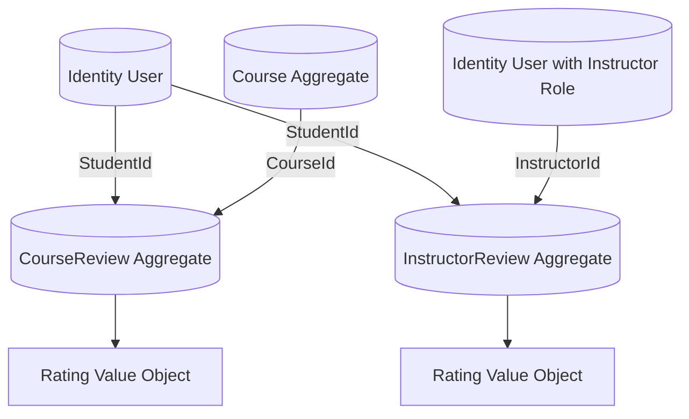

# Reviews Domain Design (DDD + Clean Architecture)

## Bounded Context

The Reviews context owns review authoring, publication, moderation, and reputation signals for the educational platform.

The context is split into two aggregate roots:

- `CourseReview`
- `InstructorReview`

Both aggregates are separate from the `Course` aggregate and the Identity aggregate. They reference other parts of the system only by ID.

## Why Separate Aggregates

- Course reviews and instructor reviews have different lifecycles and different target identities.
- Review creation and moderation are write-heavy, while read scenarios are usually aggregation-heavy.
- Keeping them separate avoids bloating the `Course` aggregate.
- The boundaries are future-proof for CQRS and modular monolith evolution.

## Aggregate Boundaries

### Course Review Aggregate

Aggregate root: `CourseReview`

Supporting types:

- `Rating` value object

Responsibilities:

- Capture student feedback for a course.
- Enforce rating range and content rules.
- Support moderation and helpful/not-helpful signals.

### Instructor Review Aggregate

Aggregate root: `InstructorReview`

Supporting types:

- `Rating` value object

Responsibilities:

- Capture student feedback for an instructor.
- Keep instructor feedback independent from course review content.
- Support moderation and publishing.

## Relationships

- `CourseReview.CourseId` -> `Course.Id`
- `CourseReview.StudentId` -> Identity user id
- `InstructorReview.InstructorId` -> Identity user id with instructor role
- `InstructorReview.CourseId` -> optional `Course.Id` context link
- `InstructorReview.StudentId` -> Identity user id

All references are ID-only.

## Business Rules

- Rating must be between 1 and 5.
- Review title and comment are required.
- Draft reviews can be edited.
- Published reviews are immutable except for moderation actions.
- A review can be flagged, hidden, or removed.
- Helpful counters are only allowed on published course reviews.

## Domain Events

- `CourseReviewCreatedDomainEvent`
- `InstructorReviewCreatedDomainEvent`
- `ReviewPublishedDomainEvent`

## Suggested Enum

- `ReviewStatus`

## Suggested Behaviors

- `Create(...)`
- `UpdateContent(...)`
- `Publish()`
- `Flag()`
- `Hide()`
- `Remove()`
- `MarkHelpful()` for course reviews
- `MarkNotHelpful()` for course reviews

## Aggregate Diagram



## Suggested Folder Structure

```text
src/LearnHub.Domain/Reviews/
  REVIEWS_ARCHITECTURE.md
  ReviewErrors.cs
  Enums/
    ReviewStatus.cs
  ValueObjects/
    Rating.cs
  Events/
    CourseReviewCreatedDomainEvent.cs
    InstructorReviewCreatedDomainEvent.cs
    ReviewPublishedDomainEvent.cs
  CourseReviews/
    CourseReview.cs
  InstructorReviews/
    InstructorReview.cs
```

## Clean Architecture Fit

- Domain layer keeps review rules and invariants.
- Application layer can add commands such as `CreateCourseReview`, `PublishCourseReview`, `CreateInstructorReview`, and `ModerateReview`.
- Queries can project review averages, moderation queues, and instructor reputation summaries.
- This design works in a modular monolith and can be separated into a standalone reviews service later.
